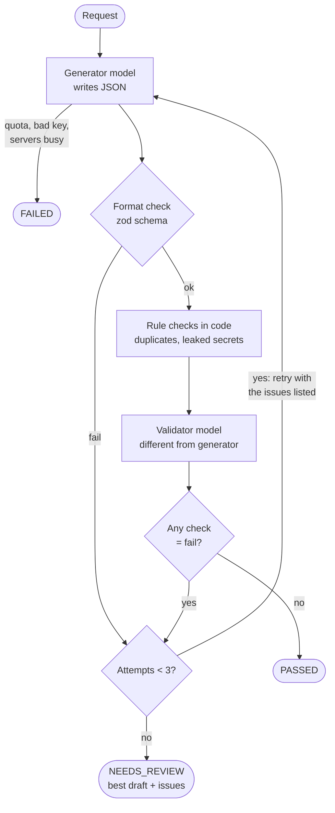

# AI pipeline & providers

_Last updated: 2026-09-27_

This explains how the backend's AI module (`backend/ai/`) works, how to set up the free Gemini tier, how to try it from the terminal, and how to switch to a paid tier or another provider (OpenAI, Claude) later.

## 1. How a generation works

Every AI step (technique suggestion, scenario draft, test-case generation) goes through the same pipeline in [backend/ai/orchestrator.js](../backend/ai/orchestrator.js):



**The four checks** (shown to the tester in step 3):

| Check | Who checks | Fails when… |
|---|---|---|
| `format` | Code (zod schemas in `schemas.js` + `checks/structure.js`) | JSON is missing fields or has wrong types, a technique wasn't requested, or a test case points at an unknown scenario or a scenario has no cases |
| `requirementCoverage` | AI validator | A rule, limit or condition in the requirement isn't covered |
| `techniqueCompliance` | AI validator | A technique is applied wrongly (e.g. boundary value without just-below/on/just-above values) |
| `rules` | Code **and** AI validator | Exact duplicates, real-looking secrets (API keys, tokens, private keys), unsafe or contradictory content. Near-duplicates, real-looking emails, card numbers and Thai IDs only **warn** |

A check can be `pass`, `warn` (usable, shown to the tester) or `fail` (triggers a retry).

**Results** (saved as a `GenerationRun` row in later slices):

| Status | Meaning | What the tester gets |
|---|---|---|
| `PASSED` | An attempt passed every check | The output |
| `NEEDS_REVIEW` | 3 attempts, none passed; or the validator itself was unavailable | The best draft plus all issues, to fix by hand |
| `FAILED` | No usable output: quota reached, servers busy, bad API key or model name, an invalid request, or 3 unreadable answers | An error message |

The **3 attempts are for quality problems only**. Problems with the AI service itself are handled separately (next section), so they don't use up those attempts. Each generation makes up to **6 AI calls** (3 attempts × generator + validator), plus any automatic retries for busy servers. Technique suggestion is a single cheap call with no AI validator.

### When the AI service has problems

| Problem (HTTP code) | What happens |
|---|---|
| Servers busy / "high demand" (500–504), or the connection drops | **Wait and retry** the same model up to 2 more times (3 s, then 8 s). Still busy → try the **fallback model** (`gemini-3.7-flash` for the generator, `gemini-3.1-flash-lite` for the validator). Busy too → `FAILED`: "Gemini is busy… try again in a few minutes" |
| Too slow: no answer within **120 s** (`AI_REQUEST_TIMEOUT_SECONDS`) | The request is cancelled and the **fallback model** is tried straight away. A model that hung once usually hangs again (we measured a 17-minute hang), so it isn't retried |
| Quota / rate limit (429) | Stop at once → `FAILED`. Waiting a few seconds doesn't help |
| Bad API key (400/401/403), model not available (404) | Stop at once → `FAILED`, with Google's explanation (e.g. "no longer available to new users") |
| Invalid request (400) | Stop at once → `FAILED`. Sending the same request again can't work |
| Answer isn't valid JSON | Counts as a failed **format** check, so it's retried |
| Validator unavailable | The draft is kept but marked `NEEDS_REVIEW`. It's never auto-approved unchecked |

The results record which model **actually** answered (e.g. the fallback), in `generatorModel` / `validatorModel`.

### Walkthrough: what happens for one request

Taking `try-ai.js cases "Users must reset their password…"` as the example:

1. **`scripts/try-ai.js`** reads the command and the text, then calls `draftScenarios()`. It only starts things and prints results.
2. **`ai/index.js`** is the front door. It asks `providers/index.js` which AI to use, then gives the job to the orchestrator labelled `kind: "SCENARIOS"`.
3. **`ai/providers/index.js`** reads `.env`. With `GEMINI_API_KEY` set, the generator is `gemini-3.5-flash` and the validator is `gemini-3.5-flash-lite`, each with a fallback model and a 120 s time limit per request.
4. **`ai/orchestrator.js`** looks up the recipe for `SCENARIOS`: the answer shape from `schemas.js` and the prompt from `prompts/draftScenarios.js`. Then it runs the attempt loop:
   1. **Build the prompt** (`prompts/draftScenarios.js` + `prompts/shared.js`): the rules, the technique guidance from `techniques.js`, the requirement inside `<requirement>` tags, and on retries the previous attempt's issues.
   2. **Call the generator** (`providers/gemini.provider.js`): the request asks Gemini to answer in JSON with exactly the given shape. Busy-server handling happens here, and SDK errors are translated into the types in `errors.js`.
   3. **Format check**: `schemas.js` (zod) checks every field and type, then `checks/structure.js` checks against the input (only the requested techniques; every test case points at a real scenario).
   4. **Code checks**: `checks/duplicates.js` and `checks/sensitiveData.js`.
   5. **Call the validator** with `prompts/validate.js`. It returns 3 verdicts, which are checked with zod too.
   6. **Decide** (`checks/result.js`): combine into the 4 checks. No `fail` → done; otherwise loop with the issues.
5. The orchestrator returns one object with the same fields as the `GenerationRun` table: status, attempts, output, checks per attempt, token usage, models.
6. For `cases`, `try-ai.js` labels the scenarios `S1, S2…` and runs the same loop with `kind: "TEST_CASES"`.

**Why it's built this way**
- **JSON schema *and* zod:** the schema makes the model *likely* to answer in the right shape, and zod *proves* it did. Some schema rules are also left out of what's sent to the provider (list-size limits that Gemini rejects), but zod still enforces them.
- **Code checks before the AI validator:** they're free, instant and certain. An AI can miss a leaked key; a regular expression can't.
- **A different validator model:** a model reviewing its own output tends to agree with itself.
- **pass / warn / fail:** only `fail` forces a redo. Warnings are shown to the tester without blocking.
- **Error types:** some problems can't be fixed by retrying (quota, bad key), others can (bad JSON, weak output).

**Safety measures built into the prompts** (`backend/ai/prompts/`):
- The requirement is wrapped in `<requirement>` tags, and the model is told to treat it as data, never as instructions. This guards against "prompt injection" hidden in an uploaded document.
- Answers are written in the requirement's language (Thai in → Thai out).
- Only fake test data is allowed (`@example.com`, published test card numbers).

## 2. Files

| File | Role |
|---|---|
| `ai/index.js` | Public API: `suggestTechniques`, `draftScenarios`, `generateTestCases`. The rest of the backend imports only this |
| `ai/orchestrator.js` | The pipeline above |
| `ai/techniques.js` | Technique list and prompt guidance. **Add new techniques here** (plus frontend translations) |
| `ai/schemas.js` | zod schemas for every AI answer. Also sent to the model as a JSON schema |
| `ai/checks/` | Code checks: structure, duplicates, sensitive data |
| `ai/prompts/` | Prompt text for each step and for the validator |
| `ai/providers/` | `gemini.provider.js`, `mock.provider.js`, and `index.js`, which picks one from env |
| `ai/errors.js` | `ProviderError`, `ProviderQuotaError`, `ProviderAuthError` |
| `ai/__tests__/` | Tests (`npm test`). They always use the mock, so no key or quota is needed |
| `scripts/try-ai.js` | Terminal tool (section 4) |

## 3. Setting up the Gemini free tier

1. Go to **https://aistudio.google.com**, sign in with a Google account, and click **Get API key → Create API key**.
2. In `backend/.env`, add:
   ```
   GEMINI_API_KEY=<your key>
   ```
   Never commit this file; `.env` is already in `.gitignore`.
3. That's all. With a key set, both the generator and the validator use Gemini automatically.

| Variable | Default | Meaning |
|---|---|---|
| `GEMINI_API_KEY` | — | Enables Gemini. Without it, the **mock** provider is used |
| `GEMINI_GENERATOR_MODEL` | `gemini-3.5-flash` | Model that writes scenarios and test cases |
| `GEMINI_VALIDATOR_MODEL` | `gemini-3.5-flash-lite` | Model that checks them (deliberately a different model) |
| `GEMINI_GENERATOR_FALLBACK_MODEL` | `gemini-3.7-flash` | Used when the generator model is busy or too slow. `none` disables it |
| `GEMINI_VALIDATOR_FALLBACK_MODEL` | `gemini-3.1-flash-lite` | Used when the validator model is busy or too slow. `none` disables it |
| `AI_REQUEST_TIMEOUT_SECONDS` | `120` | Time limit for one AI request |
| `AI_DEBUG` | off | `1` prints every AI request with timings (troubleshooting) |
| `AI_GENERATOR_PROVIDER` / `AI_VALIDATOR_PROVIDER` | `gemini` if a key is set, else `mock` | Pick the provider per role |
| `MOCK_FAIL_MODE` | `never` | Mock only: `once`, `always`, `quota` or `busy` to simulate problems |

**Free-tier limits and caveats**
- Each model has requests-per-minute and requests-per-day limits. See your current limits at https://aistudio.google.com/rate-limit. When a limit is hit, the run ends as `FAILED` with "wait a minute and try again".
- ⚠️ **Privacy:** Google states that content sent on the free tier **may be used to improve its products**; paid-tier content isn't. Use only sample or non-confidential requirements until the team moves to a paid tier. Mention this as a limitation in the project report.
- Model names change over time. On 2026-09-27 the `gemini-2.5-*` models were **no longer available to new keys**, even though the pricing page still listed them. To see which models *your* key can use, run this from `backend/`:
  ```bash
  node --env-file=.env -e 'import("@google/genai").then(async ({GoogleGenAI}) => { const ai = new GoogleGenAI({apiKey: process.env.GEMINI_API_KEY}); for await (const m of await ai.models.list()) if (m.supportedActions?.includes("generateContent")) console.log(m.name) })'
  ```
  Then set `GEMINI_GENERATOR_MODEL` / `GEMINI_VALIDATOR_MODEL` (and the `*_FALLBACK_MODEL` settings) in `.env`.
- **Why not the newest model by default?** In our free-tier measurements on 2026-09-27, `gemini-3.8-flash` was often overloaded, once hung for 17 minutes, and ran out of its daily quota after a few calls. `gemini-3.5-flash` answered a 9-case request in 30–70 s. You can still choose 3.8 with `GEMINI_GENERATOR_MODEL=gemini-3.8-flash` (e.g. on a paid key).
- **Expect 30–70 s per AI call on the free tier.** A full scenarios + test cases run makes at least 4 calls (generator + validator for each step), so a few minutes in total is normal.

## 4. Trying it from the terminal (`try-ai.js`)

`backend/scripts/try-ai.js` is a **developer tool, not part of the website**. It sends a requirement through the pipeline and prints what happened, so you can:
- check that your API key works
- judge output quality and improve prompts without clicking through the UI
- see retries and "needs review" in action
- **compare providers or models** on the same requirements. This is useful for the effectiveness evaluation in the senior project report

Run it from the `backend/` folder:

```bash
# Which techniques fit?
node --env-file=.env scripts/try-ai.js suggest "Users must reset their password via email link. The link expires after 30 minutes."

# Draft scenarios with chosen techniques
node --env-file=.env scripts/try-ai.js scenarios "…requirement…" --techniques boundaryValue,equivalencePartitioning

# Draft scenarios, then generate test cases for all of them
node --env-file=.env scripts/try-ai.js cases "…requirement…"

# Long requirement from a file, full JSON result
node --env-file=.env scripts/try-ai.js cases --file my-requirement.txt --json
```

Simulate problems (mock provider only, i.e. with no `GEMINI_API_KEY` or with `AI_*_PROVIDER=mock`):

```bash
MOCK_FAIL_MODE=once   node --env-file=.env scripts/try-ai.js scenarios "…"   # bad JSON first → retried → PASSED
MOCK_FAIL_MODE=always node --env-file=.env scripts/try-ai.js scenarios "…"   # 3 rejections → NEEDS_REVIEW
MOCK_FAIL_MODE=quota  node --env-file=.env scripts/try-ai.js suggest "…"     # rate limit → FAILED
MOCK_FAIL_MODE=busy   node --env-file=.env scripts/try-ai.js suggest "…"     # servers busy → FAILED
```

The output shows the status, each attempt with ✓ / ⚠ / ✗ per check and how many seconds each AI call took, token usage, and the scenarios or test cases.

**Troubleshooting:** add `AI_DEBUG=1` in front of the command to see every request as it happens (start, answer or error, waits, fallback), e.g.
```
[ai 12:45:32] ✗ gemini-3.5-flash failed after 3260 ms: ApiError 503 … high demand
[ai 12:45:32]   busy → waiting 3000 ms before retrying gemini-3.5-flash
[ai 12:46:20] ← gemini-3.7-flash answered in 7394 ms
```

## 5. Moving to a paid tier or another provider

### Paid Gemini
Same code. Enable billing on the Google Cloud project behind your AI Studio key (or create a key in a billed project) and use that key. Optionally switch to stronger models via `GEMINI_GENERATOR_MODEL`.

### Adding OpenAI or Claude
A provider is a small object with a `name`, a `model` and one method:

```js
// generateJson({ system, prompt, jsonSchema }) → { data, usage: { input, output } }
```

It must:
1. Send `system` + `prompt`, and ask for JSON matching `jsonSchema` (the provider's "structured output" feature).
2. Return the parsed JSON as `data`, plus token counts as `usage`.
3. Throw:
   - `ProviderQuotaError` on rate limits (429)
   - `ProviderAuthError` on a bad key or unknown model
   - `ProviderUnavailableError` when the servers are still busy after retrying
   - `ProviderError` with `code: "INVALID_JSON"` when the answer isn't JSON
   - `ProviderError` for anything else (`fatal: true` if retrying can't help, e.g. an invalid request)
4. Optionally return `model` (the model that actually answered) next to `data` and `usage`.

**Steps:**
1. `npm install <sdk>` in `backend/`.
2. Create `backend/ai/providers/<name>.provider.js` (skeletons below).
3. Register it in `backend/ai/providers/index.js` → `PROVIDERS`, reading its key and model names from env.
4. Add the env vars to `backend/.env.example`.
5. Set `AI_GENERATOR_PROVIDER=<name>` and/or `AI_VALIDATOR_PROVIDER=<name>`.
6. Run `npm test`, then compare with `try-ai.js`.

A strong, less biased setup is **different companies for the two roles**, e.g. the generator on one provider and the validator on another.

#### Claude skeleton (`@anthropic-ai/sdk`)
Claude's JSON output doesn't accept numeric or length limits (`minimum`, `maximum`, `minLength`, `maxLength`) in the schema, so they're removed before sending. Our zod format check still enforces them on the answer.

```js
// backend/ai/providers/claude.provider.js
import Anthropic from "@anthropic-ai/sdk";
import { ProviderAuthError, ProviderError, ProviderQuotaError } from "../errors.js";

const UNSUPPORTED = ["minimum", "maximum", "exclusiveMinimum", "exclusiveMaximum",
  "multipleOf", "minLength", "maxLength", "pattern", "minItems", "maxItems"];

// Remove schema keywords Claude's structured output doesn't support
function forClaude(schema) {
  if (Array.isArray(schema)) return schema.map(forClaude);
  if (!schema || typeof schema !== "object") return schema;
  return Object.fromEntries(
    Object.entries(schema)
      .filter(([key]) => !UNSUPPORTED.includes(key))
      .map(([key, value]) => [key, forClaude(value)])
  );
}

export function createClaudeProvider({ apiKey, model }) {
  const client = new Anthropic({ apiKey });

  return {
    name: "claude",
    model,
    async generateJson({ system, prompt, jsonSchema }) {
      let response;
      try {
        response = await client.messages.create({
          model,
          max_tokens: 16000,
          system,
          messages: [{ role: "user", content: prompt }],
          output_config: { format: { type: "json_schema", schema: forClaude(jsonSchema) } },
        });
      } catch (error) {
        if (error instanceof Anthropic.RateLimitError) {
          throw new ProviderQuotaError(`Claude rate limit reached for ${model}`, { cause: error });
        }
        if (error instanceof Anthropic.AuthenticationError || error instanceof Anthropic.PermissionDeniedError
            || error instanceof Anthropic.NotFoundError) {
          throw new ProviderAuthError(`Claude rejected the key or model "${model}"`, { cause: error });
        }
        throw new ProviderError(`Claude request failed: ${error.message}`, { cause: error, status: error.status });
      }

      if (response.stop_reason === "refusal" || response.stop_reason === "max_tokens") {
        throw new ProviderError(`Claude stopped early (${response.stop_reason})`);
      }

      const text = response.content.find((block) => block.type === "text")?.text ?? "";
      let data;
      try {
        data = JSON.parse(text);
      } catch (error) {
        throw new ProviderError("Claude answered with invalid JSON", { cause: error, code: "INVALID_JSON" });
      }

      return { data, usage: { input: response.usage.input_tokens, output: response.usage.output_tokens } };
    },
  };
}
```

Register it:
```js
// providers/index.js → PROVIDERS
claude: (role, env) => createClaudeProvider({
  apiKey: env.ANTHROPIC_API_KEY,
  model: role === "generator"
    ? env.CLAUDE_GENERATOR_MODEL || "claude-opus-5"
    : env.CLAUDE_VALIDATOR_MODEL || "claude-sonnet-5",
}),
```
On Claude's newest models, requests can occasionally be declined by safety classifiers (`stop_reason: "refusal"`, handled above as a failed attempt). Claude's API also offers an optional server-side "fallbacks" setting that automatically re-runs a declined request on another model; see the refusals section of Anthropic's docs if you use Claude.

Model IDs current as of 2026-09: `claude-opus-5` (most capable of these; a good generator), `claude-sonnet-5` (cheaper; a good validator), `claude-haiku-4-5` (cheapest). Check https://platform.claude.com/docs for current models and prices before choosing.

#### OpenAI skeleton (`openai`, already installed)
The same pattern applies:
- Call the SDK with the system and user messages, and request JSON-schema structured output. Use the current structured-outputs parameter from OpenAI's docs, and set the schema to strict with `additionalProperties: false` (already in our schemas).
- Parse the text, and map token usage.
- Map errors: 429 → `ProviderQuotaError`, 401/403/404 → `ProviderAuthError`.

Check OpenAI's current structured-output docs for which JSON-schema keywords are supported, and strip unsupported ones as in the Claude example.

## 6. Token usage and cost

Every result includes `usage: { generator: { input, output }, validator: { input, output } }`, and later slices store it in `GenerationRun.usage`. To estimate cost after moving to a paid tier, multiply by the provider's per-million-token prices. The same data can drive the future credit system (roadmap M5).
