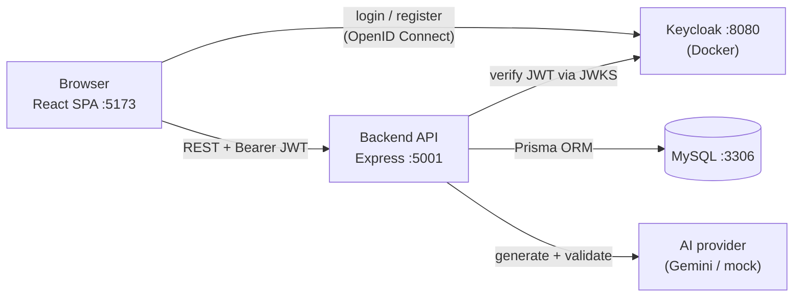
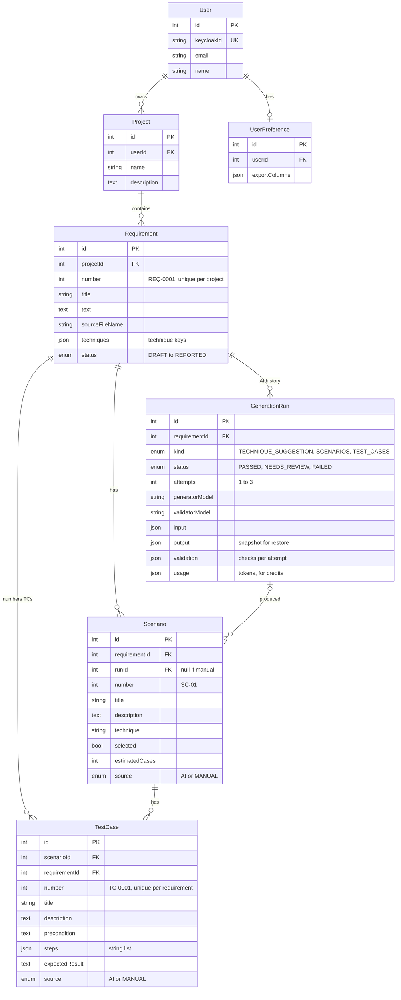
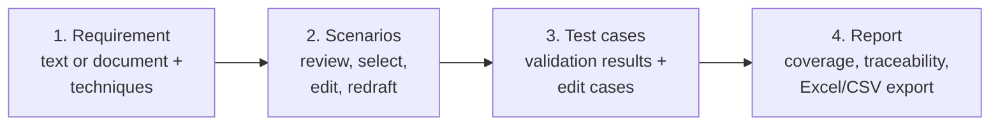

# Architecture

_Last updated: 2026-09-26_

## Overview

The AI Test Case Generator helps testers turn software requirements into test scenarios and test cases with AI, check them, and report on coverage. It's a web app made of three running parts plus a database:



## Tech stack

| Area | Technology |
|---|---|
| Frontend | React 19, TypeScript, Vite 7 (with the React Compiler), Tailwind CSS v4, react-router-dom 7, i18next (English/Thai), keycloak-js |
| Backend | Node.js, Express 5 (ES modules, JavaScript), Prisma 6, jose (JWT verification) |
| Database | MySQL |
| Auth | Keycloak 26 in Docker, with a custom login theme and Google login |
| AI | Provider-agnostic layer: Gemini (free tier) for now, plus a mock provider for development and tests |

## Repository layout

```
AI-test-case-generator/
├── frontend/              React SPA
│   └── src/
│       ├── auth/          Keycloak instance, AuthProvider, useAuth()
│       ├── components/
│       │   ├── ui/        Design-system pieces (Button, Card, Badge, Modal, …)
│       │   ├── layout/    AppLayout, TopNav, Sidebar, UserMenu
│       │   └── …          Feature components (dashboard, workspace, project, requirement, coverage)
│       ├── pages/         One file per route
│       ├── services/      API clients; the only place pages get data from
│       ├── mocks/         Temporary fake data behind the services (removed as real APIs arrive)
│       ├── i18n/          i18next setup + en/th dictionaries
│       ├── utils/         Small helpers (class names, formatting, exporters)
│       ├── config.ts      Environment-specific settings (API URL, Keycloak)
│       └── index.css      Tailwind + design tokens (colors, fonts)
├── backend/               Express API
│   ├── routes/            URL → controller mapping (+ auth middleware)
│   ├── controllers/       HTTP layer: parse request, call service, send response
│   ├── dto/               Request-body validation
│   ├── services/          Business logic + database access
│   ├── middleware/        auth.js (JWT verification)
│   ├── ai/                AI pipeline: providers, prompts, checks, orchestrator (see ai-providers.md)
│   ├── scripts/           Developer tools (try-ai.js)
│   ├── config/            keycloak.js (shared Keycloak settings)
│   ├── docs/              openapi.js (Swagger base definition)
│   └── prisma/            schema.prisma, migrations, Prisma client
├── keycloak/themes/       Custom Keycloak login/register theme
├── docker-compose.yml     Runs Keycloak
└── docs/                  This documentation
```

## Authentication flow

1. The frontend starts Keycloak (`check-sso`) before rendering ([frontend/src/main.tsx](../frontend/src/main.tsx)). If the user isn't logged in, the login page redirects to Keycloak. Keycloak handles registration, email/password login and Google login.
2. Every API call sends `Authorization: Bearer <access token>`. The token is refreshed automatically if it expires within 30 seconds ([frontend/src/services/api.ts](../frontend/src/services/api.ts)).
3. The backend checks the token's signature against Keycloak's public keys (JWKS) and the issuer ([backend/middleware/auth.js](../backend/middleware/auth.js)), then puts the token claims on `req.user`.
4. `getOrCreateUser()` links the Keycloak user (`sub`) to a row in our `User` table, creating it on first use.
5. Every project query is scoped to that user, so users only ever see their own data.

## Backend layering

```
routes/*.routes.js → controllers/*.controller.js → dto/* (validation) → services/*.service.js → prisma/client.js
```

Current endpoints (all require login):

| Method | Path | Purpose |
|---|---|---|
| GET | `/api/me` | Get (or create) the current user |
| GET | `/api/projects` | List the user's projects |
| POST | `/api/projects` | Create a project |
| GET | `/api/projects/:id` | Get one project (404 if it isn't the user's) |

### API docs (Swagger)

With the backend running, open **http://localhost:5001/api/docs**. The raw OpenAPI spec is at `/api/docs.json`.

- Each endpoint is documented by an `@openapi` comment directly above its route in `backend/routes/*.js`. Shared schemas and security settings are in [backend/docs/openapi.js](../backend/docs/openapi.js). **When you add an endpoint, add its comment in the same change.**
- To call endpoints from Swagger, click **Authorize** and choose one of:
  - **keycloak (OAuth2)**: log in through Keycloak. This needs a one-time Keycloak setting in the admin console (http://localhost:8080 → realm `ai-test-case-generator` → *Clients* → `ai-test-case-frontend` → *Settings*):
    - *Valid redirect URIs*: add `http://localhost:5001/api/docs/oauth2-redirect.html`
    - *Web origins*: add `http://localhost:5001`
    - then click *Save*
  - **bearerAuth**: paste an access token. No Keycloak change is needed.


## Data model

Display codes like `REQ-0001`, `SC-01` and `TC-0001` aren't stored. Each table stores a plain `number`, and the app formats it.



Deleting a project removes its requirements. Deleting a requirement removes its runs, scenarios and test cases. Deleting a run keeps its scenarios (their `runId` becomes empty).

`Requirement.status` controls which steps of the tester flow are unlocked:
`DRAFT` → `SCENARIOS_READY` → `CASES_READY` → `REPORTED`.

## Main tester flow (target for Milestone 1)



Each AI step goes through the same pipeline: **generate → format check → rule checks → AI validation (a different model) → retry up to 3 times**. If it still fails, the result is marked *needs review* for the tester to fix by hand. Every generation is stored as a `GenerationRun`, so the tester can restore any of the last 10.

## AI module (`backend/ai/`)

A self-contained module. The rest of the backend imports only `backend/ai/index.js`:

| Function | Used in | Returns |
|---|---|---|
| `suggestTechniques({ requirementText })` | Step 1 "Let AI suggest" | Suggested techniques with reasons |
| `draftScenarios({ requirementText, techniques })` | Step 1 → 2 | Scenarios (title, description, technique, estimated case count) |
| `generateTestCases({ requirementText, techniques, scenarios })` | Step 2 → 3 | Test cases linked to scenarios |

Each returns an object shaped like a `GenerationRun` row: status, attempts, output, per-attempt check results, token usage and model names. Providers are swappable: Gemini (free tier) now, a mock for tests and offline work, and OpenAI/Claude can be added. Full details, setup and the switching guide: [ai-providers.md](ai-providers.md).

## Frontend structure

- **Routing** ([frontend/src/App.tsx](../frontend/src/App.tsx)): `/` Dashboard, `/workspace` Projects, `/projects/:projectId`, `/projects/:projectId/requirements/:requirementId`, `/history` and `/account` (coming soon). All pages share `AppLayout` (top nav + sidebar).
- **Data access:** pages only call functions in `src/services/`. Where the backend isn't ready yet, those functions return data from `src/mocks/`. Swapping to the real API changes only the service function.
- **Design system:** colors and fonts are Tailwind tokens in [frontend/src/index.css](../frontend/src/index.css) (`ink`, `brand`, `success`, `warning`, `danger`; Space Grotesk / IBM Plex Sans / IBM Plex Sans Thai / IBM Plex Mono). The shared pieces live in `components/ui/`.
- **Languages:** every UI string comes from `i18n/locales/en.ts` and `th.ts`. The chosen language is remembered in the browser.

## Configuration

Settings come from environment variables, with local-development defaults. See `frontend/.env.example` and `backend/.env.example`.

| Variable | Where | Purpose |
|---|---|---|
| `VITE_API_URL` | frontend | Backend base URL |
| `VITE_KEYCLOAK_URL`, `VITE_KEYCLOAK_REALM`, `VITE_KEYCLOAK_CLIENT_ID` | frontend | Keycloak connection |
| `DATABASE_URL` | backend | MySQL connection string |
| `PORT` | backend | API port (default 5001) |
| `KEYCLOAK_URL`, `KEYCLOAK_REALM` | backend | Used to verify tokens (and by Swagger) |
| `KEYCLOAK_CLIENT_ID` | backend | Client used by Swagger's "Authorize" (default `ai-test-case-frontend`) |
| `GEMINI_API_KEY`, `GEMINI_GENERATOR_MODEL`, `GEMINI_VALIDATOR_MODEL`, `GEMINI_*_FALLBACK_MODEL`, `AI_REQUEST_TIMEOUT_SECONDS`, `AI_GENERATOR_PROVIDER`, `AI_VALIDATOR_PROVIDER`, `MOCK_FAIL_MODE` | backend | AI settings; see [ai-providers.md](ai-providers.md#3-setting-up-the-gemini-free-tier) |
